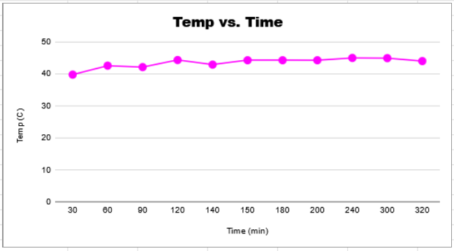

# Battery Pack Testing

## Project Description
- Takes readings of the voltage of a load resistor over time to determine the total watt-hours of the battery pack. Uses a LabJack T7.

## Development
### Lead Error Analysis Writeup
- When conducting battery tests, a positive and negative lead wire are connected from the battery back to a load resistor with known resistance.  We measure the voltage across this known resistance over time to calculate energy. This energy measurement, however, is slightly less than the actual energy output of the battery pack because a small amount of energy is dissipated by the lead wires and is not included in our measurement.
- The 18 gauge copper lead wires are 15 inches long each. For a temperature range of 25°C to 65°C, the total 30 inches of lead wires is calculated to have a resistance of 16.275-18.775 mOhms.
- When using a DMM to measure to voltage over one of the leads and a load resistor  when attached to a battery pack, the voltage over one of the leads is found to be 14.77mV and the load is 5.11109 V. Since the load resistor is 5.13 ohms, the current is determined to be 0.996313 A. This means that the resistance of the lead we measured would be 14.824 mOhms.
- The resistance of both leads should be about 29.6 mOhms.
- As these measurements were conducted at room temperature, it is assumed that the expected resistance of the leads would be 16.275 mOhms. Our measured resistance is 1.82 times the size of our expected resistance, which most likely comes from the alligator clip connections.
- Using the measured resistance of 29.6 mOhms, the percent error between the combined resistance of the 5.13 load resistor and the lead wires compared to just the 5.13 Ohm load resistor is 0.58%.
- By ignoring the resistance of the leads, there is a source of error of 0.58%.

### Resistor Error Analysis Testing
- The resistors, over a span of a few months, were measured daily to see if time effected the resistor's values. No relationship was found.

- The resistors relationship with temperature and power was measured by using a power supply and a temperature sensor. A linear relationship was found where an increase in temperature cased an increase in resistance, and an increase in power caused an increase in the resistor's temperature.

- The load resistors peak temperature was measured when put over 5W.

### Part 2: Code Development
- Developed code to do continuous reads of voltage at an interval and saves to a csv file. Once the battery pack runs out of power, the program ends the reads and processes the data to get the total Wh.

## Testing Procedure
1. Connect a T7 to your computer using USB.
2. Connect a resistor with a known resistance to the positive and negative side of a battery terminal using an 18 gauge USB cable.
3. Wire to the T7 with the following connections:
Negative terminal side of resistor -> GND
Positive terminal side of resistor -> AIN0
4. Download the attached zip folder named "BatteryPackTesting." Unzip it.
5. Open VS code, and create a new blank project. Select "File"<"Open"<"Cmake". Select the CMakeLists from the "BatteryPackTesting" folder. Wait for VS to open everything.
6.  Then select "Build"<"Build All". 
7. Press the green arrow labeled "battery.exe"
8. This will run the code and open command prompt. You will have to fill in some information about your test. As you are filling this in, connect the battery pack you are testing via the 18 gauge USB. Once you are done entering the information, the code should start printing numbers, and these numbers will the voltage reading, which should be around 5 V.
9. Once the code is done running, go the google drive folder linked above. Go to the respective folder with the same name as the battery pack you tested. Upload the .csv file that was outputted from the code. It will be in the out folder in your code.
10. When done uploading, you will have to press the three dots on the side of the upload. Hover over the "Open With" menu and select "Google Sheets." Wait for it to load.
11. When loaded, you will be able to see the data from the test. Only one read every minute is recorded, but reads were taken every second (unless you change the code). Save the values of the Average Voltage, Total WH, and Total mAH.

### Battery Pack Results
- For a vast majority of battery packs tested, the advertised Wh is significantly smaller than the actual Wh.

## Acknowledgments
- This work was my part of a project at Labjack Corporation, other part of project was done by intern Josh Kempe of Labjack Corporation
- Libraries/Tools: T7, LJM Library, 200W resistors, C++, CMake Program, VS Code
